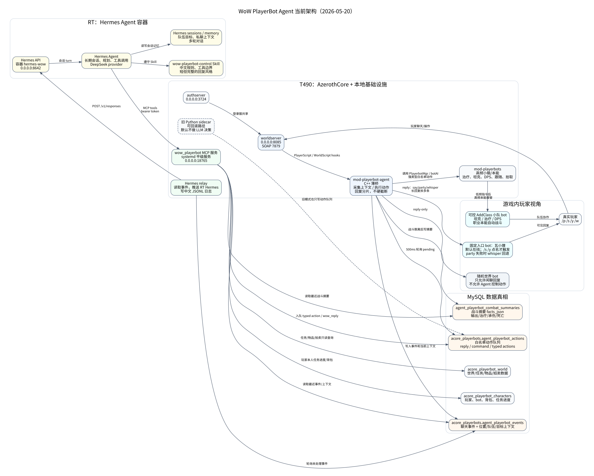

# Agent PlayerBot 架构真相源

最后核对：2026-05-22

本文件是当前 `playerbot-agent` 分支的架构真相源。部署拓扑、数据库归属、端口、模块边界、Agent 分层和关键设计变化，都以这里为准。

后续 Harness / Planner Agent、Intent Schema 和阶段路线图见：[ROADMAP-agent-playerbots.md](ROADMAP-agent-playerbots.md)。

不要把 API key、bearer token、数据库密码或其他密钥写进本文档。

## 当前结论

当前分支不再沿着旧的 `mod-agent-control` 自研底层行为继续合并开发，而是以成熟的 `mod-playerbots` 作为底层行为/本能系统，在其上增加 LLM-Agent 的聊天理解、任务理解、队伍意图识别和宏观调度。

2026-05-08 已落地第一版试验实现：

```text
modules/mod-playerbot-agent
  - 游戏内薄桥接模块
  - 捕获真实玩家聊天
  - 把事件写入 acore_playerbots.agent_playerbot_events
  - 轮询 acore_playerbots.agent_playerbot_actions
  - 执行 reply / command / strategy 以及队伍生命周期强类型白名单动作

tools/playerbot-agent/agent_bridge.py
  - Python 侧车大脑
  - 中文规则优先
  - 可选 OpenAI-compatible LLM
  - 输出 Playerbots 小脑可执行的安全动作

tools/playerbot-mcp/
  - Hermes Harness 接入层
  - MCP 工具服务暴露安全的 WoW PlayerBot tools
  - Hermes relay 把游戏事件推送到 RT 上的 Hermes Agent conversation
  - 仍只通过 agent_playerbot_actions 写入白名单动作
```

2026-05-18 已把 Hermes 模式补到可日常指挥的基础面：MCP 既有召唤、初始化、下线、刷新、升级、任务、邀请等生命周期 typed tools，也暴露了跟随、停留、撤退、攻击、拉怪、ready、重点治疗、拾取、buff、治疗输出策略等低频 command/strategy typed tools。Harness/Hermes 不直接拼聊天快捷命令，优先调用这些 typed tools；未包装的 `.playerbots bot` 子命令才走 `wow_run_playerbot_command` 兜底。

2026-05-20 默认运行路径切到 Hermes：固定入口 bot `瓦小狸` 默认在线，`/s`、`/y` 需要点名才转给 Hermes；`/p`、`/raid` 仍走队伍上下文；回复要求短但完整，传输层会拆分长消息，不再硬截断半句话。

2026-05-21 增加事件边界保护：relay 发送给 Hermes 的每轮输入都带 `current_event_id`，所有会回复或执行动作的 MCP 调用必须使用这个事件 ID。MCP 入队层默认拒绝已处理旧事件上的动作，防止 Agent 记忆污染后拿旧 `event_id` 重复召唤、下线或回复。worldserver 执行动作时使用 connected player 查找请求者，降低玩家明明在线但动作返回 `requester is not online` 的概率。

同日补齐离线队伍成员上下文：私聊瓦小狸时也带发言玩家自己的队伍，`group_members` 会输出队伍名单里的离线 slot；离线 bot 标记为 `group_offline`。relay 对“队友上线/小队回来/灰名叫回”有确定性 fast-path，直接执行 `add <BotName>`，不再让 Hermes 从空队伍快照里猜。

2026-05-22 生产运行从 T490 迁到 RT。RT 同时运行 auth/world 容器、Hermes 容器、MCP、Hermes relay 和注册页；T490/当前开发机只负责写代码、测试、编译和部署，不再作为生产侧车。RT 的 relay 增加 `unprocessed_only` 轮询和 `PLAYERBOT_HERMES_SKIP_BACKLOG_ON_START=1` 积压跳过语义，避免迁移/重启后补跑玩家已经离线的旧事件。`TeamId:uint8` 旧事件 JSON 兼容修复保留在 MCP，同时 C++ 桥已改为输出数值 team。

核心分层：

```text
LLM-Agent 大脑
  - 理解中文聊天和上下文
  - 判断玩家意图、队伍需求、短期目标
  - 输出结构化意图，不直接操作游戏原语

Agent 意图适配器
  - 把大脑意图翻译成 Playerbots 能理解的命令/API
  - 校验权限、目标、冷却、频率和安全边界
  - 记录执行结果，给大脑做反馈

Playerbots 本能/小脑
  - 职业战斗循环、治疗、坦克、DPS、BUFF、驱散
  - 跟随、移动、躲 AOE、逃跑、复活、召唤、组队辅助
  - 装备、天赋、技能、补给、拾取、任务同步、副本/BG 策略

AzerothCore 世界
  - 地图、角色、战斗、寻路、数据库、网络会话
```

Hermes 模式下，`playerbot-agent` 旧侧车不再直接做 LLM 决策；RT 上的 `playerbot-hermes-relay` 将 `agent_playerbot_events` 推给 RT 上的 Hermes，Hermes 再通过 RT 本机 WoW MCP 工具写入 `agent_playerbot_actions`。旧侧车保留为可回滚实现，但生产不依赖 T490。

大模型不应该每秒决定“按哪个技能”。这类高频行为属于 Playerbots 本能。大模型应该决定“现在需要一个治疗进队”“这句话是在叫我组人”“这波打完先休整”“这个副本需要坦克+治疗+3DPS”。

## 当前架构图



图源文件：`doc/agent-playerbot-architecture.dot`。渲染产物同时保留 `doc/agent-playerbot-architecture.svg` 和 `doc/agent-playerbot-architecture.png`，需要更新时执行：

```bash
dot -Tsvg doc/agent-playerbot-architecture.dot -o doc/agent-playerbot-architecture.svg
dot -Tpng doc/agent-playerbot-architecture.dot -o doc/agent-playerbot-architecture.png
```

## 当前部署

### 共享登录

```text
authserver: 0.0.0.0:3724
auth 库:    acore_auth
公网入口:   38.207.189.99
```

### RT PlayerBot Agent 生产服

```text
RT 运行目录:     /home/wuya/git/azerothcore-wotlk-git
RT compose:      ops/rt-wow-migration/docker-compose.yml
进程管理:        Docker Compose + systemd
auth 容器:       wow-auth，0.0.0.0:3724
world 容器:      wow-world，0.0.0.0:8085
SOAP:            0.0.0.0:7879
Hermes 容器:     hermes-wow，0.0.0.0:8642
MCP systemd:     azerothcore-playerbot-mcp.service，0.0.0.0:18765
relay systemd:   azerothcore-playerbot-hermes-relay.service
注册页 systemd:  azerothcore-account-register.service，127.0.0.1:18080
auth 库:         acore_auth
world 库:        acore_playerbot_world
角色库:          acore_playerbot_characters
Playerbots 库:   acore_playerbots
核心分支:        playerbot-agent
核心上游:        playerbots-core/Playerbot
模块:            modules/mod-playerbots
Agent 桥模块:    modules/mod-playerbot-agent
旧 Agent 侧车:   tools/playerbot-agent/agent_bridge.py，生产默认不用
```

Realm：

```text
id=1  线路一  38.207.189.99:8085
id=2  线路二  8.162.5.68:8085
authserver.conf: RealmList.RealmIDAliases = "2:1"
```

两个线路都指向 RT 同一个 worldserver。`8085` 是 PlayerBot Agent 服；它复用 `acore_auth`，但使用独立 world/characters/playerbots 数据库，避免污染旧生产数据。

## 当前运行策略

RT 当前按“可控 AddClass 小队优先、随机世界 bot 关闭”的低负载模式运行。AddClass bot 是玩家/Agent 可调度的小队成员；随机世界 bot 能力保留但默认不开，用于后续压测或世界氛围测试。即使重新打开随机世界 bot，LLM 也只能让它们闲聊回复，不能控制移动、战斗、治疗或拾取。

关键配置：

```text
AiPlayerbot.Enabled = 1
AiPlayerbot.RandomBotAutologin = 0
AiPlayerbot.MinRandomBots = 0
AiPlayerbot.MaxRandomBots = 0
AiPlayerbot.DisabledWithoutRealPlayer = 0
AiPlayerbot.PlayerHotspotBots = 1
AiPlayerbot.PlayerHotspotMinBots = 6
AiPlayerbot.PlayerHotspotMaxBots = 10
AiPlayerbot.PlayerHotspotRadius = 120
AiPlayerbot.PlayerHotspotCooldown = 600
AiPlayerbot.PlayerHotspotScanInterval = 30
AiPlayerbot.RandomBotJoinLfg = 1
AiPlayerbot.RandomBotJoinBG = 1
AiPlayerbot.RandomBotTalk = 0
AiPlayerbot.RandomBotSuggestDungeons = 0
AiPlayerbot.AddClassCommand = 1
AiPlayerbot.AddClassAccountPoolSize = 10
AiPlayerbot.ApplyInstanceStrategies = 1
AiPlayerbot.CombatStrategies = "-healer dps"
AiPlayerbot.CommandServerPort = 0
AgentPlayerbot.Enabled = 1
AgentPlayerbot.ActionPollIntervalMs = 500
AgentPlayerbot.MaxReplyLength = 0
AgentPlayerbot.AnchorBotAutologin = 1
AgentPlayerbot.AnchorBotName = "瓦小狸"
AgentPlayerbot.AnchorBotAliases = "小狸"
```

服务器性能调优：

```text
MinWorldUpdateTime = 10
MapUpdateInterval = 50
MapUpdate.Threads = 1
```

当前数据库里已经生成：

```text
PBAGENT* bot 账号: 55
bot 角色:          550
RT 当前 AddClass 池: 10
测试迁移真人角色: 9
```

`AiPlayerbot.CombatStrategies = "-healer dps"` 是当前试玩期的保守设置：治疗 bot 仍会治疗、驱散、保命、喝水和跟随，但默认不额外启用治疗输出策略，降低“治疗跟着战士日常打怪时抢仇恨”的概率。后续如果要测试更激进的效率，可以改回空字符串或由 Adapter 按场景切换策略。

已从旧测试角色库 `acore_agent_characters` 通过 AzerothCore `pdump` 迁移到当前 `acore_playerbot_characters`：

| 账号 | 角色 |
| --- | --- |
| `WUYA_TEST` | `小猎` Lv1 猎人、`中年狼` Lv1 牧师、`乌鸦` Lv2 法师、`Wuya` Lv19 战士 |
| `WUGUI` | `滑才怪` Lv19 猎人 |
| `XIAOWU` | `小宝` Lv2 术士、`小德` Lv19 德鲁伊 |
| `GM` | `小管` Lv58 盗贼 |
| `WUJI` | `赛博丶执著爱` Lv20 圣骑士 |

迁移前备份保存在：

```text
/home/wuya/backups/azerothcore-wotlk-git/playerbot-test-migration-20260508/
```

## Playerbots 提供的本能

这里的“本能”指不需要 LLM 每一步判断、已经由 Playerbots/C++ 规则系统高频处理的能力。当前清单主要来自 `PlayerbotMgr`、`RandomPlayerbotMgr`、`ChatCommandHandlerStrategy` 和 `AiFactory`。不是模块里的所有命令都应暴露给 LLM。本文档用四个等级描述可调用程度：

| 等级 | 含义 | Agent 侧处理 |
| --- | --- | --- |
| L1 | 当前已经能通过 `.playerbots` 命令桥或 SOAP 间接调用 | 可以先包装成 Intent Adapter |
| L2 | bot 上线后自动生效的策略/行为树本能 | 上层通过职业、初始化、队伍目标和策略调参间接控制 |
| L3 | 底层已有聊天快捷命令、Action 或 C++ 能力，但还没有安全强类型 API | 通过 MCP 通用命令入口执行，由 worldserver 按玩家权限校验并返回结果 |
| L4 | 模块支持但当前配置关闭，或只适合 GM/维护 | 默认不暴露给 LLM |

### L1：当前可直接包装的命令桥本能

这些能力已经能从游戏内 `.playerbots bot ...` 使用，也可以由 MCP typed tools 或通用 `wow_run_playerbot_command` 代执行。Agent 应优先使用 typed tools；遇到未包装能力时再使用通用命令入口。

| Agent intent | 当前 Playerbots 小脑语言 | 说明 |
| --- | --- | --- |
| `lookup_bot_pool` | `.playerbots bot lookup` | 查看 AddClass 池中可召唤 bot。 |
| `summon_bot` | `.playerbots bot addclass <class> [male\|female\|0\|1]` | 从 AddClass 池按职业召唤同阵营 bot。职业参数：`warrior`、`paladin`、`hunter`、`rogue`、`priest`、`shaman`、`mage`、`warlock`、`druid`、`dk`。 |
| `list_bots` | `.playerbots bot list` | 列出当前玩家可控 bot。 |
| `dismiss_bot` | `.playerbots bot remove <name>`，别名 `logout`、`rm` | 让指定 bot 下线。`*` 可作用于队伍内 bot，但 Adapter 应做权限和确认。 |
| `login_account_bot` | `.playerbots bot add <charname>` | 登录玩家自己账号或可信账号上的指定角色作为 bot。 |
| `login_account_bots` | `.playerbots bot addaccount <account-or-char>` | 登录指定账号下角色。需要账号/可信账号权限，默认不作为第一批开放能力。 |
| `init_bot` | `.playerbots bot init=auto <name>` | 给 AddClass bot 按主人等级和装备分数初始化装备。非 GM 受 `autoInitOnly` 影响时应只用 `init=auto`。 |
| `init_bot_quality` | `.playerbots bot init=green/blue/epic/legendary <name>` | 按品质初始化装备。别名包括 `white/common`、`green/uncommon`、`blue/rare`、`epic/purple`、`legendary/yellow`。建议只给 GM Adapter 暴露。 |
| `init_bot_gearscore` | `.playerbots bot init=<gearScore> <name>` | 按 gear score 上限初始化装备。建议只给 GM Adapter 暴露。 |
| `refresh_bot` | `.playerbots bot refresh <name>` | 刷新 AddClass bot 装备/状态。 |
| `refresh_bot_raid_lock` | `.playerbots bot refresh=raid <name>` | 解除副本绑定相关状态。源码里标注该能力还不完美，默认不作为常规玩家能力。 |
| `level_bot` | `.playerbots bot levelup <name>`，别名 `level` | 让 AddClass bot 跟随等级初始化。 |
| `init_instance_quests` | `.playerbots bot quests <name>` | 初始化副本任务。 |
| `reload_playerbot_config` | `.playerbots bot reload` | 重新读取 Playerbots 配置。通过通用入口时仍由服务端 GM 权限判断。 |
| `toggle_selfbot` | `.playerbots bot self` | 给真人角色启用/关闭 bot AI。通过通用入口时仍由服务端配置和权限判断。 |

### L2：上线后自动运行的核心本能

这些能力不需要上层逐条调用。只要 bot 被召唤、初始化并跟随主人，Playerbots 会在战斗/非战斗/死亡状态下自动选择动作。

| 类别 | 已存在的本能 | 上层大脑如何调控 |
| --- | --- | --- |
| 职业战斗循环 | 全职业基础输出、治疗、坦克、驱散、控制、AOE、爆发、施法距离、攻击距离、站位 | 主要通过 `summon_bot` 的职业选择、初始化质量、队伍组成和后续 `set_strategy` 控制。 |
| 坦克行为 | `tank`、`tank assist`、`pull`、`pull back`、`tank face`、威胁/拉怪相关策略 | 大脑决定“需要坦克”“让坦克开怪/停手”，小脑处理具体技能和仇恨。 |
| 治疗行为 | `heal`、`holy heal`、`cure`、`save mana`、`healer dps`、低血/低蓝阈值 | 大脑决定是否召治疗、是否进入休整，小脑持续治疗、驱散、省蓝。 |
| DPS 行为 | `dps`、`dps assist`、各职业专精、`behind`、`boost`、`max dps` 相关策略 | 大脑决定集火目标、是否爆发，小脑负责技能循环。 |
| 非战斗跟随 | `follow`、`formation`、`stay`、回到主人、距离控制 | 大脑只表达“跟我/停在这/散开”，小脑处理移动。 |
| 战斗安全 | `avoid aoe`、`flee`、`runaway`、药水、食物/喝水、复活/死亡跟随 | 大脑不用逐秒躲技能，只决定是否撤退、休整、复活。 |
| Buff 和宠物 | 职业 Buff、图腾/祝福/法师护甲、猎人/术士宠物、死亡骑士/猎人等职业资源 | 大脑不调单个 Buff，最多设置队伍目标或角色定位。 |
| 拾取和物品 | `loot`、ROLL、开箱/开锁、装备/卸装、自动装备升级、包裹补给 | 大脑可以决定“允许拾取/卖垃圾/准备副本”，小脑处理细节。 |
| 任务和成长 | 接/交/共享任务、任务同步、自动任务/RPG、清理过期任务 | 大脑负责宏观任务选择，小脑执行 NPC 交互和移动。 |
| 移动和旅行 | 坐骑、飞行点、旅行目的地缓存、寻路、召唤到主人附近 | 大脑说目标，小脑处理怎么走。 |
| 副本/团队 | `ApplyInstanceStrategies`、副本和团队 Boss 专用触发器/动作、队伍职责 | 大脑负责组队和目标，小脑负责 Boss 技能应对。 |
| BG/竞技场 | 战场策略、竞技场策略、战场目标移动 | 当前随机 bot 自动进 BG 已关闭，后续只在明确测试时打开。 |

职业策略已经覆盖 WotLK 十职业，常见策略名包括：

```text
priest:  dps, shadow debuff, shadow aoe, heal, holy heal, cure
mage:    arcane, fire, frost, frostfire, dps, cc, aoe, cure
warrior: tank, tank assist, pull, pull back, arms, fury, aoe
shaman:  ele, resto, enh, cure, aoe, totem/buff strategies
paladin: tank, heal, dps, cure, blessings, aoe
druid:   caster, caster aoe, caster debuff, heal, cat, bear, cure
hunter:  bm, mm, surv, cc, dps assist, aoe, pet/bdps
rogue:   melee, dps, dps assist, aoe
warlock: affli, demo, destro, curse, cc, aoe, pet
dk:      blood, frost, unholy, tank assist, pull, aoe
```

“战士玩家 + 治疗 bot 跟随打怪”的主要实现位置：

| 行为 | 代码位置 | 说明 |
| --- | --- | --- |
| 按职业/天赋挂默认战斗策略 | `modules/mod-playerbots/src/Bot/Factory/AiFactory.cpp` | 牧师非暗影挂 `heal`/`holy heal`，奶骑/奶德/奶萨挂治疗策略；治疗角色还会挂 `save mana`，当前运行配置再移除 `healer dps`。 |
| 牧师治疗触发器 | `modules/mod-playerbots/src/Ai/Class/Priest/Strategy/HealPriestStrategy.cpp` | 根据队友血量触发盾、愈合祷言、苦修、快速治疗、治疗祷言、痛苦压制等。 |
| 仇恨抑制 | `modules/mod-playerbots/src/Ai/Base/Strategy/ThreatStrategy.cpp` | `+threat` 策略被启用时，组队状态下高仇恨动作会被降权；牧师默认在中等仇恨时触发 `fade`。 |
| 跟随/停留/拉怪等指令 | `modules/mod-playerbots/src/Ai/Base/Strategy/ChatCommandHandlerStrategy.cpp` | 支持 `follow`、`stay`、`attack`、`pull`、`flee`、`ready` 等 bot 聊天快捷指令。 |

这些能力可以被包装：上层 Adapter 不需要调用“快速治疗”这种单个技能，只需要控制 `summon_bot`、`init_bot`、`bot_follow`、`bot_stay`、`bot_attack_target`、`set_strategy` 这类低频意图。

### L3：底层已有但需要 Adapter 包装的可控本能

这些动作在 Playerbots 中已经有聊天快捷命令、Action 或策略变化入口，但当前还没有我们自己的强类型、安全边界和中文理解层。它们可以作为第二批 Adapter API。

| 目标能力 | 底层入口 | 建议 Adapter 形态 |
| --- | --- | --- |
| 让 bot 跟随 | bot 聊天快捷命令 `follow` | `bot_follow(bot, target=master)` |
| 让 bot 原地停留 | `stay` | `bot_stay(bot, position=current)` |
| 让 bot 远离/散开 | `move from group`、`flee`、`runaway`、`warning`、`disperse` | `bot_spread(bot/group)`、`bot_retreat(bot/group)` |
| 攻击/协助攻击 | `attack`、`tank attack`、`pull`、`pull back`、`pull rti` | `bot_attack_target(bot, target)`、`bot_pull(bot, target)` |
| 爆发输出 | `max dps` | `set_combat_mode(bot/group, "burst")` |
| 准备确认 | `ready` | `ready_check(group)` |
| 复活/灵魂医者 | `revive` | `bot_revive(bot)` |
| 任务交互 | `accept`、`talk`、`q`、`qi`、`quests`、`reward` | `bot_accept_quest`、`bot_turnin_quest`、`bot_query_quest` |
| 物品和交易 | `t`/`nt`、`buy`、`sell`、`equip`、`unequip`、`use`、`roll` | `bot_trade`、`bot_buy`、`bot_sell`、`bot_equip`、`bot_roll` |
| 施法 | `cast`、`castnc` | `bot_cast_spell(bot, spell, target)`，必须做白名单。 |
| 宠物控制 | `pet`、`pet attack` | `bot_pet_command(bot, command, target)` |
| 天赋/雕文类维护 | `glyphs`、`glyph equip`、maintenance 相关动作 | GM 或受控维护任务，不给聊天自由调用。 |
| 策略切换 | `ChangeStrategy("+x,-y", state)` | `set_strategy(bot/group, add=[...], remove=[...], state=combat/noncombat/dead)` |
| 邀请真实玩家 | AzerothCore 组队 API，Playerbots 有组队/队伍上下文但当前没有现成 `.playerbots bot invite <player>` 命令 | `invite_player(target_player)`，需要 C++ Adapter 或安全动作层。 |

重点：LLM 可以识别“跟我”“停一下”“开怪”“爆发”“加我”“加个奶”，但它输出的应该是结构化 intent。Adapter 再翻译成上表里的小脑语言。不要让 LLM 直接拼英文聊天快捷命令，也不要直接执行数据库写入。

### L4：当前默认关闭或不建议暴露的能力

这些能力在模块里存在，但不是普通 LLM-Agent 能自由调用的控制面，或者资源/安全风险较高。

| 能力 | 当前状态 | 原因 |
| --- | --- | --- |
| 随机 bot 自动上线 | RT 当前关闭：`RandomBotAutologin=0`、`MinRandomBots=0`、`MaxRandomBots=0` | RT J1900 资源有限，默认优先保证可控 AddClass 小队和 Hermes 链路。 |
| 随机 bot 自动进 LFG/BG/竞技场 | 配置项保留，但随机 bot 数量为 0 时不会形成实际生态 | 需要测试随机生态时单独打开并观察 CPU/延迟。 |
| 随机 bot 世界/公会/交易频道聊天 | RT 当前不跑随机世界 bot；真人密语随机 bot 的 reply-only 流程保留在代码路径里 | 随机 bot 只可闲聊，不允许控制动作。 |
| `.playerbots rndbot ...` | GM/控制台能力：`stats`、`reload`、`update`、`reset`、`init`、`clear`、`level`、`refresh`、`teleport`、`revive`、`grind`、`change_strategy` | 这是随机生态维护接口，不是普通 Agent 本能。需要测试随机生态时单独打开。 |
| `.playerbots gtask ...` | GM 公会任务维护 | 不属于小队本能。 |
| `.playerbots pmon/debug ...` | 性能监控/调试 | 运维工具，不给 LLM。 |
| `.playerbots account ...` | 玩家账号绑定/解绑 | 涉及账号权限，不能由 LLM 自由调用。 |
| Playerbots CommandServer | `AiPlayerbot.CommandServerPort = 0` | 当前关闭，后续若启用也必须加认证、限流和审计。 |

### 第一批建议暴露给 LLM-Agent 的本能 API

第一阶段 v1 已实现的是“聊天 + 指挥队伍内 AddClass bot”。v2 已把队伍生命周期动作补成 C++ 强类型白名单动作，不再让 Python 侧车通过 SOAP 或原始命令直接控制。

v1.2 增加随机世界 bot 的密语闲聊：C++ 事件上下文会标注 `bot_kind`，包括 `owned`、`group`、`random_world`、`addclass_world`。当真人密语 `random_world/addclass_world` 这类非可控世界 bot 时，Python 侧车只向 LLM 暴露 `reply/no_reply`，C++ 执行层也只对 `reply` 放宽到任意在线 Playerbot；`command/strategy` 仍必须是 owned/group bot。

| Skill | 底层小脑语言 | 说明 |
| --- | --- | --- |
| `reply` / `no_reply` | bot 以 `party`/`whisper`/`say` 发言 | 人设聊天和简短确认。 |
| `bot_follow` | `follow` | 跟随主人/队伍。 |
| `bot_stay` | `stay` | 原地停留。 |
| `bot_retreat` | `flee` | 跟随撤退，偏保守。 |
| `bot_runaway` | `runaway` | 跑远/散开。 |
| `bot_attack_target` | `attack` | 攻击玩家当前目标。 |
| `bot_pull` | `pull` | 让 bot 拉玩家当前目标。 |
| `bot_ready` | `ready` | 准备确认。 |
| `focus_heal_add` | `focus heal +<玩家名>` | 治疗 bot 重点照看某个队友，例如“加我/奶我”。 |
| `focus_heal_remove` | `focus heal -<玩家名>` | 取消重点治疗。 |
| `focus_heal_clear` | `focus heal clear` | 清空重点治疗列表。 |
| `loot_off` | `-loot` | 关闭非战斗拾取策略。 |
| `loot_normal` | `+loot` + `ll normal` | 恢复正常拾取策略。 |
| `loot_gray` | `+loot` + `ll gray` | 允许捡灰色垃圾。 |
| `loot_all` | `+loot` + `ll all` | 全捡。 |
| `buff_on` / `buff_off` | `+buff` / `-buff` | 打开/关闭非战斗 buff 策略。 |
| `healer_safe` | `-healer dps` | 治疗专心奶，降低抢仇恨风险。 |
| `healer_burst` | `+healer dps` | 允许治疗补输出。 |

Hermes MCP 已支持的第一批队伍指挥 typed tools：

```text
wow_bot_follow(bot_name="group")
wow_bot_stay(bot_name="group")
wow_bot_retreat(bot_name="group", mode="flee|runaway")
wow_bot_attack_target(bot_name="group")
wow_bot_pull(bot_name?, pull_back=false)
wow_bot_ready(bot_name="group")
wow_bot_burst(bot_name="group")
wow_focus_heal(bot_name="healers", target_player?, mode="add|remove|clear")
wow_set_loot_mode(mode="off|normal|gray|all", bot_name="group")
wow_set_buff(enabled=true|false, bot_name="group")
wow_set_healer_dps(enabled=false|true, bot_name="healers")
```

v2 已支持的队伍生命周期动作：

```text
summon_bot(role, class_hint, gender?, race_hint?)
dismiss_bot(bot_name)
list_bots()
lookup_bot_pool()
init_bot(bot_name, mode="auto")
refresh_bot(bot_name)
level_bot(bot_name)
init_instance_quests(bot_name)
invite_player(player_name)
```

第三阶段再考虑任务、交易、补给、旅行、随机生态和副本专用调度。

## 大脑能否调控本能

能，但要通过 MCP 这一层基础设施。常用能力仍保留强类型工具；缺口能力走 `wow_run_playerbot_command`，它只进入 PlayerbotMgr，不碰数据库、不走 GM 控制台，最终由 worldserver 按请求玩家的 `.playerbots bot` 权限判断。

推荐接口形态：

```json
{
  "intent": "summon_bot",
  "role": "healer",
  "class_hint": "priest",
  "gender": "female",
  "reason": "队伍缺治疗"
}
```

typed tools 负责翻译成 Playerbots 小脑语言：

```text
.playerbots bot addclass priest female
.playerbots bot init=auto <botName>
```

Playerbots 原生 `addclass` 只支持职业和性别，不支持种族。若上层指定 `race_hint`，MCP 先查询 AddClass 账号池里的具体候选角色，再执行：

```text
.playerbots bot add <BotName>
```

例如“人类女牧师”会先匹配 `class=priest`、`race=human`、`gender=female` 的离线 AddClass 角色，再登录该角色。

通用命令入口则接收 `.playerbots bot` 后面的参数：

```text
wow_run_playerbot_command(command_line="remove Gessa")
wow_run_playerbot_command(command_line="refresh Gessa")
wow_run_playerbot_command(command_line="list")
```

或未来直接调用 C++ 内部 API：

```text
SummonAddClassBot(master, class, gender)
InitializeBot(bot, mode=auto)
SetBotStrategy(bot, strategy)
InvitePlayer(target)
DismissBot(bot)
```

### “加我”示例

玩家说“加我”时，大脑不要机械执行命令。它要先判断语境：

```text
1. 谁说的？
2. 他是否已经在队伍里？
3. 他是在请求被邀请进队，还是在请求加一个 bot？
4. 当前说话频道是密语、附近、世界，还是队伍？
5. 我是否有权限邀请他，队伍是否满员？
```

然后输出结构化意图：

```json
{
  "intent": "invite_player",
  "target_player": "说话者",
  "source": "whisper",
  "confidence": 0.91
}
```

适配器把它转成小脑动作：

```text
invite_player(target_player)
```

如果语境是队伍里有人说“加个奶”或“加我个奶”，大脑应输出：

```json
{
  "intent": "summon_bot",
  "role": "healer",
  "class_hint": "priest"
}
```

适配器再执行：

```text
.playerbots bot addclass priest
```

现状：`addclass` 这类 Playerbots 本能已经可用；“邀请某个真实玩家进队”已经通过 `invite_player` 强类型动作落到 C++ 安全动作层，不能用 `addclass` 命令替代。

## Agent 控制接口路线

当前已经接入第一版薄适配层。

第一阶段 v1：DB 队列桥

```text
真实玩家聊天
  -> mod-playerbot-agent 写 agent_playerbot_events
  -> Python sidecar 规则/LLM 识别意图
  -> 写 agent_playerbot_actions
  -> mod-playerbot-agent 执行白名单动作
  -> Playerbots 小脑处理具体行为
```

优点：不需要让 Python 伪造玩家会话；bot 可以以自己的身份说话；Playerbots 仍然负责具体战斗和移动。

限制：typed 控制动作只对 owned/group bot 生效；随机世界 bot 只能密语闲聊；通用 `.playerbots bot` 命令入口只进入 PlayerbotMgr 并继承玩家权限，不允许直接数据库、GM 控制台或任意服务端命令。

当前 LLM 运行时使用 OpenAI-compatible Chat Completions。DeepSeek Flash 的推荐配置是：

```text
OPENAI_BASE_URL=https://api.deepseek.com
PLAYERBOT_AGENT_MODEL=deepseek-v4-flash
PLAYERBOT_AGENT_LLM_THINKING=disabled
PLAYERBOT_AGENT_LLM_MAX_TOKENS=512
```

运行时 key 只进入进程环境，不进入配置文件或仓库。规则层先处理明确中文指令；LLM 只负责更自然的闲聊、复杂表达和意图归一化，输出仍必须是 Adapter 能验证的 JSON。

v1.1 增加战斗感知管线：

```text
UnitScript/PlayerScript 战斗 hook
  -> C++ 内存聚合伤害/治疗/死亡/击杀/仇恨风险
  -> 战斗脱离后写 agent_playerbot_combat_summaries.facts_json
  -> Python sidecar 压缩 summary_text
  -> 主 Agent prompt 带最近战斗摘要和最近 action 执行结果
```

原则：主 Agent 不消费逐条原始战斗日志，只消费当前环境、短战斗摘要和动作执行结果。这样能让 Agent 理解“刚才打得怎么样”，又不会被高频战斗事件拖慢或污染决策。

第二阶段：更完整 C++ Adapter

```text
modules/mod-playerbot-agent
  - 增加更强类型的 bot 生命周期 API
  - 提供 summon_bot / invite_player / dismiss_bot / set_strategy 等强类型动作
  - 内部调用 Playerbots 管理器或排队操作
```

优点：可靠、可观测、权限清晰。

第三阶段：Agent 记忆和复盘

```text
队伍聊天 / 战斗摘要 / 死亡 / 蓝量 / 位置 / 命令结果
  -> 短期战斗记忆
  -> 长期经验库
  -> 下次副本/任务前检索
  -> 大脑调整策略
```

## 旧文档状态

旧 Agent 原型已保存到：

```text
branch: archive/agent-control-v1-20260508
commit: 29b386eb4 archive agent control prototype
```

旧文档位置：

```text
/home/wuya/git/azerothcore-wotlk/ARCHITECTURE-agent-playerbots.md
/home/wuya/git/azerothcore-wotlk/README-agent-playerbots.md
```

旧文档中关于“分层 Agent、聊天理解、人设、安全边界、LLM 不做帧级操作”的原则继续有效；关于 `mod-agent-control`、`agent API 8790`、`acore_agent_world`、旧测试运行目录等部署细节已经过时。

以后当前分支以本文件为准。
